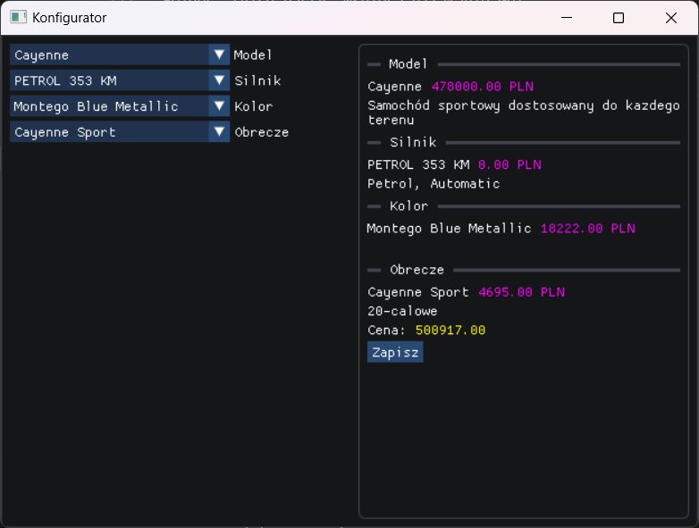
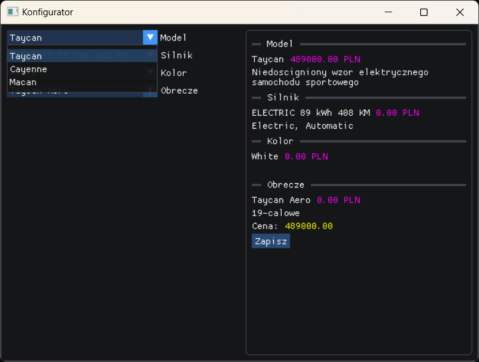

<div style="text-align: center; padding-bottom: 50px">
    <h1 style="font-size: 1.5em">Projekt <br> Wstęp do programowania w języku C/C++</h2>
    <h1 style="font-size: 3em">Konfigurator samochodowy</h1>
    <p style="font-size: 1.2em">Autorzy: Mateusz Miś, Łukasz Musiał, Maciej Żwirski</p>
</div>

# Wstęp

## Cel projektu

Napisać program w języku C++ przy użyciu technik programowania obiektowego, takich jak dziedziczenie, polimorfizm oraz klasy abstrakcyjne i wewnętrzne. Program ma umożliwiać odczyt i zapis danych do pliku.

## Opis programu

Program pozwala na konfigurację samochodu poprzez wybór parametrów z list rozwijalnych. Na podstawie wybranych opcji program oblicza całkowity koszt samochodu. Wybrane parametry, szczegółowy opis i cena, są wyświetlane w podsumowaniu. Konfigurację można zapisać do pliku. Program działa tylko na systemie Windows.

# Działanie programu

W lewej części okna programu znajdują się listy rozwijalne z opcjami konfiguracji. W prawej części znajduje się podsumowanie, które zawiera nazwy wybranych części, ich cenę oraz szczegóły. Również w podsumowaniu, na dole znajduje całkowity koszt pojazdu oraz przycisk, który zapisuje utworzoną konfigurację do pliku `data/config`.



Wybrane opcje z list rozwijalnych można zmieniać. 



Po ponownym kliknięciu przycisku odpowiadającego za zapis konfiguracji do pliku, poprzednia konfiguracja zostanie nadpisana. 

```
// Przykładowa zawartość pliku data/config

Model: Taycan
Silnik: ELECTRIC 89 kWh 408 KM
Kolor: White
Obrecze: Taycan Aero
```

# Implementacja

## Format pliku do przechowywania modeli samochodów

Plik, w którym przechowywane są dane dotyczące modeli pojazdów, składa się z instrukcji, które są wykonywane linia po linii. Każda instrukcja składa się z nazwy instrukcji i listy argumentów. Dodanie nowego modelu pojazdu rozpoczyna instrukcja _model_, która przyjmuje nazwę, cenę bazową oraz opis, np.:
```
model "Taycan" 489000 "Niedościgniony wzór elektrycznego samochodu sportowego"
```
Kolejne instrukcje opisują dostępne części dla danego modelu, np.:
```
color "Papaya Metallic" 4256
color "Crayon" 10589
```
Oznacza to, że dla danego modelu dostępne są dwa kolory o podanych nazwach i cenach, które są określone w argumentach.

Program zakłada, że definicje modeli znajdują się w pliku `data/models`, który jest wczytywany na samym początku działania programu w funkcji `init_models()` w pliku `src/program.cpp`.

```c++
// fragmenty funkcji init_models()
std::ifstream file(program::models_path);

car_model *current_model = 0;
std::string line;
for(int line_number = 1; std::getline(file, line); ++line_number) {
    if(line.empty()) continue;

    std::istringstream stream(line);

    std::string command;
    stream >> command;

    if(command == "model") {
        ...
    } else {
        if(current_model) {
            std::string name;
            float price;
            stream >> std::quoted(name) >> price;

            if(command == "engine") {
                ...
            } else if(...) {
                ...
            } else {
                ...
                continue;
            }
        } else {
            ...
            continue;
        }
    }
}

file.close();
```

## Okno aplikacji

### Rejestrowanie Window Class

```c++
WNDCLASSEXW wc = {};
wc.cbSize = sizeof(wc);
wc.lpfnWndProc = WindowProc;
wc.hInstance = GetModuleHandle(0);
wc.lpszClassName = L"HelloSailor";

RegisterClassExW(&wc);
```

### Tworzenie okna

```c++
DWORD style = WS_OVERLAPPEDWINDOW|WS_SIZEBOX;
HWND hwnd = CreateWindowW(
    wc.lpszClassName, 
    L"Konfigurator", 
    style,
    CW_USEDEFAULT, CW_USEDEFAULT, 
    640, 480,
    0, 0, wc.hInstance, 0);
```

### Pokazanie okna

```c++
ShowWindow(hwnd, SW_SHOWDEFAULT);
```

## Dear ImGui

Interfejs użytkownika stworzono przy użyciu biblioteki _Dear ImGui_. Zgodnie z dokumentacją, aby zacząć użwyać tej biblioteki trzeba stworzyć _kontekst Dear ImGui_ używając `ImGui::CreateContext()`. Następnie zainicializować używająć `ImGui_ImplWin32_Init()` i `ImGui_ImplDX11_Init()`. Na początku pętli głównej programu wywołać `ImGui_ImplDX11_NewFrame()`, `ImGui_ImplWin32_NewFrame()` oraz `ImGui::NewFrame()`, a na końcu `ImGui::Render()` i `ImGui_ImplDX11_RenderDrawData()`.

```c++
// Wybrane fragmentu z src/main.cpp

ImGui::CreateContext();

ImGui_ImplWin32_Init(hwnd);
ImGui_ImplDX11_Init(d3d11_device, d3d11_device_context);

// Pętla główna
for(...) {
    ...

    ImGui_ImplDX11_NewFrame();
    ImGui_ImplWin32_NewFrame();
    ImGui::NewFrame();

    program::update();

    ImGui::Render();
    ImGui_ImplDX11_RenderDrawData(...);

    ...
}

ImGui_ImplDX11_Shutdown();
ImGui_ImplWin32_Shutdown();
ImGui::DestroyContext();
```

W metodzie `program::update()` tworzony jest cały układ interfejsu użytkownika.  

```c++
// fragment z pliku program.cpp wyświetlająy podsumowanie
ImGuiWindowFlags window_flags = ImGuiWindowFlags_None;
ImGui::PushStyleVar(ImGuiStyleVar_ChildRounding, 5.0f);
ImGui::BeginChild("ChildR", ImVec2(0, 0), ImGuiChildFlags_Borders, window_flags);
{
    static char const *separators[] = {"Model", "Silnik", "Kolor", "Obrecze"};
    for(auto i = 0; i < config.components.size(); ++i) {
        auto *component = config.components[i];

        ImGui::SeparatorText(separators[i]);

        ImGui::Text("%s", component->get_name().c_str());
        ImGui::SameLine();
        ImGui::TextColored(ImVec4(1, 0, 1, 1), "%.2f PLN", component->get_price());

        ImGui::TextWrapped("%s", component->get_details().c_str());
    }

    ImGui::Text("Cena:");
    ImGui::SameLine();
    ImGui::TextColored(ImVec4(1, 1, 0, 1), "%.2f", config.get_price());

    if(ImGui::Button("Zapisz")) {
        ...
    }
}
ImGui::EndChild();
```

## Programowanie obiektowe

### Klasa Abstrakcyjna

W pliku `src/components/car_component.hpp` znajduje się definicja klasy abstrakcyjnej `car_component`. O tym, że jest to klasa abstrakcyjna świadczą dwie metody czysto wirtualne. Nie można utworzyć obiektu takiej klasy.

```c++
class car_component {
public:
    ...
    // Metody czysto wirtualne
    virtual std::string get_details() const = 0;
    virtual float get_price() const = 0;
    ...
};
```

### Dziedziczenie

Wszystkie klasy opisujące części samochodu w `src/components/` dziedziczą publicznie po klasie abstrakcyjnej `car_component`.

```c++
class car_XXX : public car_component {
public:
    ...
    std::string get_details() const;
    float get_price() const;

private:
    ...
};
```

### Polimorfizm

Wykorzystano w metodzie `car_config::get_price()`, gdzie klasa `car_config` zawiera pole `std::array<car_component *, 4> components`. Pozwala policzyć cenę całego samochodu, bez znajomości dokładnego typu poszczególnych części samochodu.

```c++
// implementacja metody car_config::get_price()
float result = 0;
for(auto *component : components) {
    result += component->get_price();
}
return result;
```

# Wnioski

Realizacja projektu pozwoliła na zdobycie podstawowej wiedzy z zakresu programowania obiektowego. Nauczyliśmy się, jak tworzyć okno aplikacji i obsługiwać zdarzenia od użytkownika oraz systemu operacyjnego, wykorzystując Win32 API. Ponadto, zapoznaliśmy się z procesem inicjalizacji DirectX11 oraz tworzeniem swap chain, który umożliwia wyświetlanie obrazu w oknie. Dodatkowo, poznaliśmy bibliotekę Dear ImGui, której użyliśmy do stworzenia interfejsu użytkownika. Link do repozytorium: https://github.com/cHJvamVrdHkK/project-1

# Źródła

https://learn.microsoft.com/en-us/windows/win32/learnwin32/creating-a-window

https://learn.microsoft.com/en-us/windows/win32/direct3d11/atoc-dx-graphics-direct3d-11

https://en.cppreference.com/w/

https://github.com/ocornut/imgui

http://www.directxtutorial.com