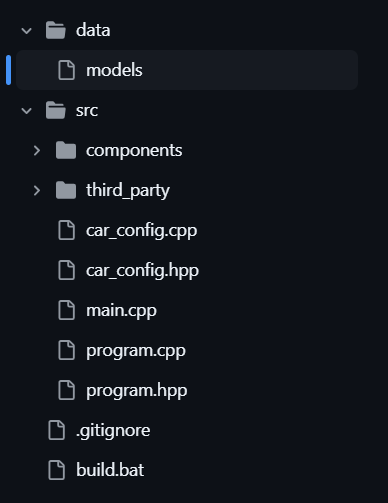
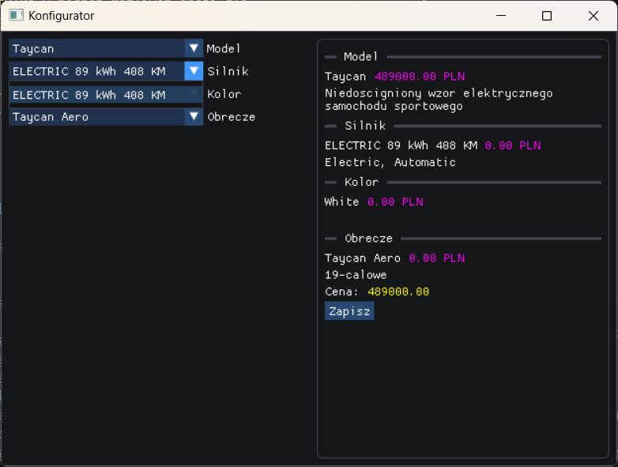
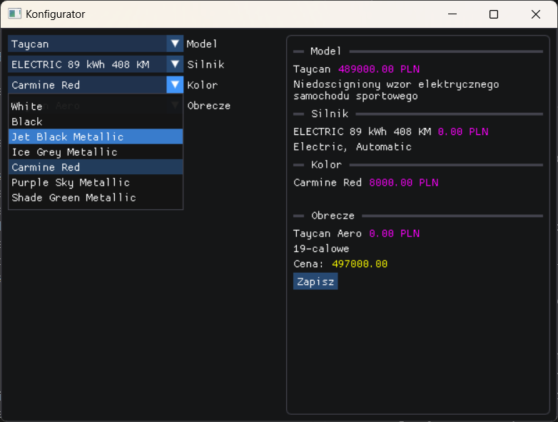
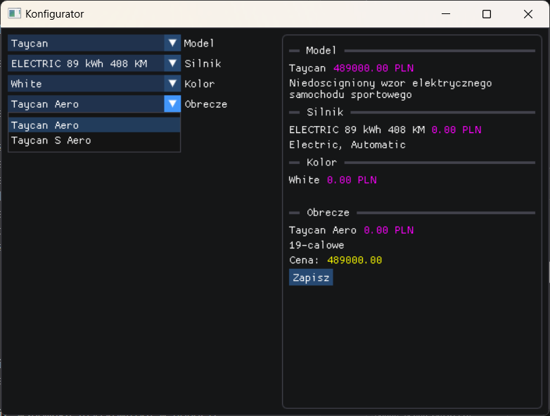
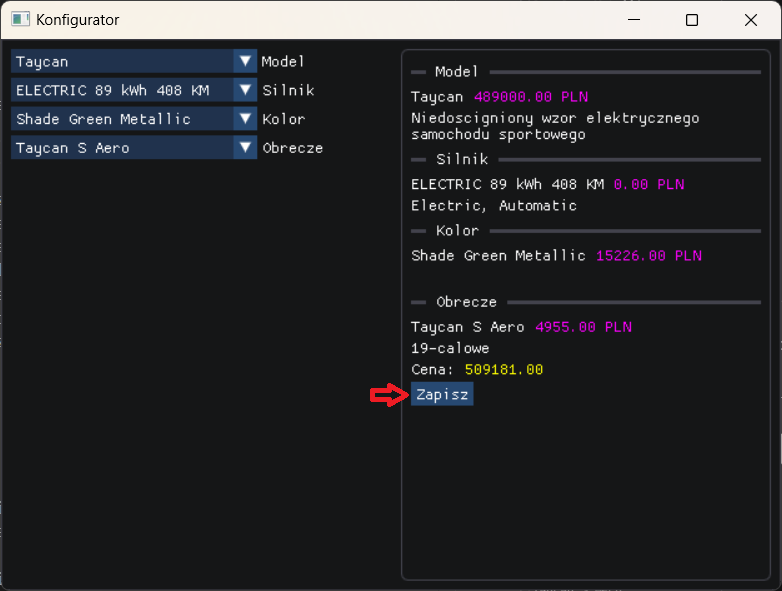
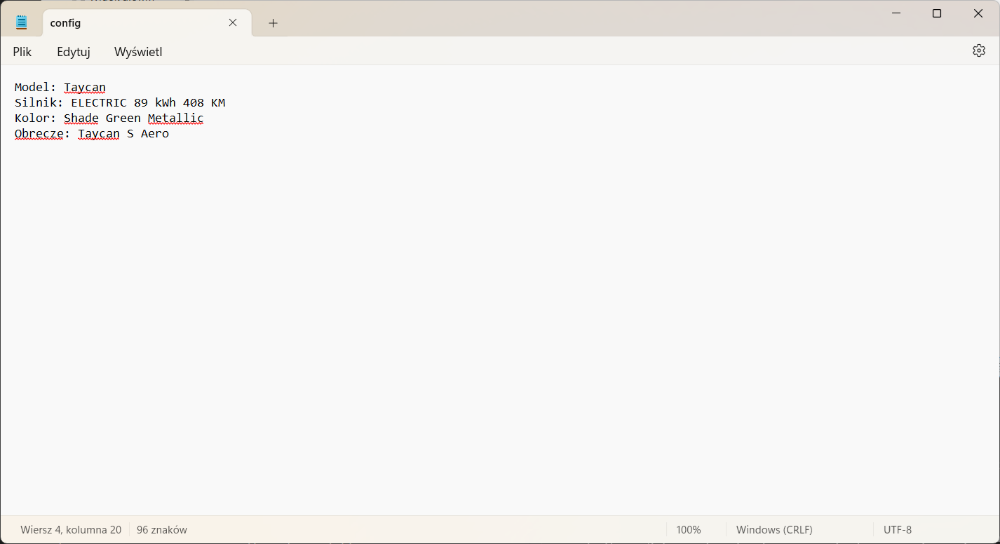

## Temat projektu: Konfigurator samochodowy 

## Nazwiska autorów: Żwirski, Miś, Musiał 

# Wstęp teorytyczny: 

## Cel projektu 

Napisać program w języku C++ przy użyciu technik programowania obiektowego, takich jak dziedziczenie, polimorfizm oraz klasy abstrakcyjne i wewnętrzne. u. Program ma umożliwiać odczyt i zapis danych do pliku. 

## Opis projektu 

Program pozwala na konfigurację samochodu poprzez wybór parametrów z list rozwijalnych. Na podstawie wybranych opcji program oblicza całkowity koszt samochodu. Wybrane parametry, szczegółowy opis i cena, są wyświetlane w podsumowaniu. Program pozwala na zapis konfiguracji samochodu do pliku. 

# Opis implementacji z fragmentami kodu źródłowego: 

## Z wymagań dotyczących projektu: 

## Dziedziczenie 

Dziedziczenie w C++ jest jednym z kluczowych elementów programowania obiektowego. Umożliwia ono tworzenie nowych klas (klas pochodnych), które dziedziczą cechy (pola i metody) z istniejących już klas (klas bazowych). Dzięki dziedziczeniu można ponownie używać kodu, rozszerzać jego funkcjonalność i zapewnić lepszą strukturę programu.

Przykładowy fragment z car_wheels.hpp: 
```c++
class car_wheels : public car_component { 
    public: 
    explicit car_wheels(std::string name, float price, float radius) 
        : car_component(name, price), radius(radius) {} 

    std::string get_details() const; 

    float get_price() const; 
    
    private: 

    float radius; 
}; 
```

## Polimorfizm 

Polimorfizm w C++ to jedna z kluczowych zasad programowania obiektowego, która pozwala na definiowanie różnych zachowań dla różnych klas przy użyciu wspólnego interfejsu. Innymi słowy, dzięki polimorfizmowi możemy wywoływać metody w klasach pochodnych za pomocą wskaźnika lub referencji do klasy bazowej. 

Przykładowy fragment w car_component.hpp: 
```c++
    public: 
    car_component(std::string name, unsigned int base_price) 

        : name(name), base_price(base_price) {} 

    virtual std::string get_details() const = 0; 

    virtual float get_price() const = 0; 

    virtual std::string const &get_name() const { 

        return name; 

    } 
```
## Klasy abstrakcyjne 

Klasa abstrakcyjna to taka klasa, która zawiera co najmniej jedną metodę czysto wirtualną. Klasy abstrakcyjne nie mogą być instancjonowane (nie można utworzyć ich obiektu), ale mogą być używane jako klasy bazowe. Służą one do definiowania interfejsów lub wspólnego zachowania dla klas pochodnych. 

Przykładowy fragment w car_component.hpp: 
```c++
public: 
    car_component(std::string name, unsigned int base_price) 

        : name(name), base_price(base_price) {} 

    virtual std::string get_details() const = 0; 

    virtual float get_price() const = 0; 

    virtual std::string const &get_name() const { 

        return name; 
    } 

protected: 

    std::string name; 

    float base_price;  
```
 

## Klasy wewnętrzne 

Klasy wewnętrzne w C++ to klasy zdefiniowane wewnątrz innej klasy. Są one używane, gdy chcemy, aby dana klasa była logicznie powiązana z inną klasą, ale niekoniecznie była dostępna poza tą klasą. Klasy wewnętrzne mają kilka zastosowań, takich jak enkapsulacja szczegółów implementacyjnych czy organizacja kodu w przejrzysty sposób. 

Przykładowy fragment w 

 

## Odczytywanie z pliku 

Odczyt danych z pliku w C++ został zrealizowany za pomocą stream z biblioteki <fstream>. 

Przykładowy fragment w program.cpp: 
```c++
std::ifstream file(program::models_path); 
```
## Zapisywanie do pliku 

Zapis do pliku w C++  został zrealizowany za pomocą klasy std::ofstream, dostępnej w bibliotece <fstream>. (Tak jak powyżej) Po zrealizowaniu zadania, plik zostaje zamknięty. 

Przykładowy fragment w program.cpp: 
```c++
stream >> std::quoted(name) >> price >> std::quoted(desc);
```
## Struktura projektu



W folderze “data” znajdują się dwa pliki zawierające konfiguracje: 

-”config “zawierający konfiguracje z programu (plik powstaje dopiero po zapisaniu konfiguracji) 

-”models” zawierający już gotowe modele 

W folderze ”src” znajduje się cały program. 

W folderze ”components” znajdują się wszystkie komponenty pojazdu w konfiguracji. 

Folder ”third_party” wspiera działanie GUI 

## Interfejs imgui

Do wykonania tego projek

# Przykłady działania ze zrzutami ekranu: 

Początkowy widok konfiguracji pojazdu: 


W lewej części GUI znajdują się dostępne opcje konfiguracji. Kolejno: Model, Silnik, Kolor i Koła. W prawej części jest natomiast podsumowanie i szacowany koszt za pojazd. 

Dostępne są trzy modele. Taycan, Cayenne oraz Macan. Zmiana modelu nie wpływa na szacowany koszt. 


Silnik jest sprzedawany tylko w jednej możliwej opcji dla zoptymalizowania produkcji pojazdu. 



Następnie wybieramy kolor. W zależności od koloru jaki wybierze użytkownik ogólna wycena konfiguracji może się zmienić. Domyślnie dla pojazdu kolor jest biały i jego wycena jest za 0 PLN.



Ostatnie do wyboru zostały nam opony. Do wyboru mamy różne dobory opon w zależności od wybranego modelu, tak aby użytkownik przez przypadek nie skonfigurował złego modelu opon z modelem pojazdu. 



Gdy nasza konfiguracja jest już gotowa klikamy ”Zapisz”. 



Gdy to zrobimy, w folderze ”Data” w pliku ”config” pojawi się nam zapisana konfiguracja pojazdu. 

 

Okienko konfiguracji po zapisaniu się nie wyłącza, w przypadku gdy zaszła jakaś pomyłka bez żadnych problemów jesteśmy w stanie zmienić opcje w konfiguratorze i zapisać poprawną. Po takich operacjach konfiguracja zostanie nadpisana. Jeśli wszystko jest w porządku, okienko można zamknąć klikając w okienko zamykające.  


# Wnioski: 

Opracowany program umożliwia konfigurację samochodu poprzez wybór dostępnych opcji, automatyczne obliczenie wstępnych kosztów opłat oraz zapis i odczyt konfiguracji w pliku w formie raportu. Skutecznie wspomaga użytkownika w doborze komponentów samochodu tworząc ostatecznie jego konfiguracje. Interfejs graficzny programu (GUI) został zaprojektowany z myślą o intuicyjnej obsłudze użytkownika, a wszelkie zmiany w programie są przetwarzane w czasie rzeczywistym i prezentowane w panelu statusu w prawej części okna. Wybrane opcje są zapisywane w pliku w formie raportu. Program nie wyłącza się automatycznie po zapisaniu danych, co umożliwia użytkownikowi natychmiastowe wprowadzanie poprawek. Dzięki temu rozwiązanie wspiera użytkownika w efektywnym procesie konfiguracji pojazdu. 